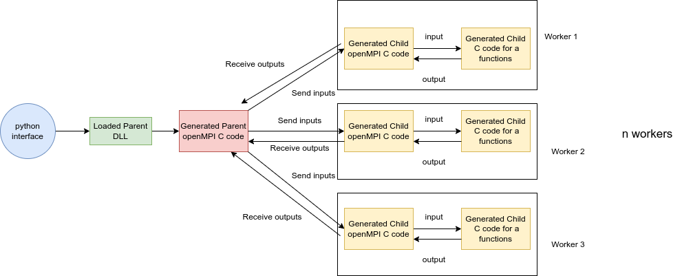

# Distributed AD: Add OpenMPI Support to Loma

## Abstract

The primary goal of our project is to enhance `loma` by integrating support for OpenMPI (Open Message Passing Interface). This integration will enable `loma` to distribute and parallelize the compilation process across multiple machines, significantly improving compilation speed and efficiency. By splitting a very large dataset across several machines, we can effectively test various inputs for a particular function, leveraging the computational power of distributed systems.

## Loma OpenMPI Extension Architecture

The OpenMPI extension of Loma is supported by the implementation described below:

1. **Parser Codebase Extension**:

   - The parser codebase has been extended to support another decorator `@openMPI`. If this decorator is found, the parser sets a parameter as `is_openMPI` to `true` in the `FunctionDef`.

2. **Compiler Codebase Modification**:

   - If a `FunctionDef` is found, it generates two different C files: one which acts as a parent and the other which acts as a child.

3. **Parent Codebase Compilation**:

   - The parent codebase is compiled as a DLL (shared library) and can be loaded easily in Python. The main purpose of the parent is to spawn `n` (present as a parameter to the parent function) child workers which will execute the function. Additionally, the parent will send all the required parameters to the child processes and gather and receive the output from the child processes. This gathered output is what is sent back to the Python interface.

4. **Child Codebase Compilation**:
   - The child codebase is compiled as a regular object file. This is necessary as OpenMPI parallelization can only be invoked in files which have a `main` function. This child codebase additionally contains a wrapper on top of the concerned function which receives the parameters from the parent and sends back the response to the parent.

_Figure 1: Open MPI implementation in Loma. The loma compiler generates two OpenMPI-based C code files. One DLL which acts as a parent and spawns multiple child workers. These child workers are the second generated files which contain an OpenMPI wrapper on top of the actual generated C function._

## Project Structure

The project is organized within the directory `hw_tests/project`, which includes the following components:

1. **documentation**: This directory houses the installation guide for OpenMPI and project documentation, offering comprehensive insights into project setup and functionality.

2. **plots**: Within this directory, various plots generated during the project reside, showcasing visual representations of data and results.

3. **tests**: This directory hosts two distinct Python files:

   - **forward_test.py**: Contains test cases specifically designed for forward differentiation.
   - **reverse_test.py**: Contains test cases tailored for reverse differentiation.

4. **experiments**: This directory contains detailed experimentation conducted throughout the project, providing empirical validation and analysis of the implemented functionalities.

This structured organization facilitates clarity and ease of navigation, ensuring efficient access to project components and resources essential for development, testing, and documentation purposes.
